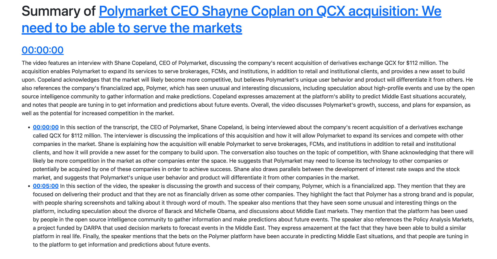

# YTTL

<p align="center">

<h1 align="center">YTTL</h1>
<h3 align="center">An AI-powered YouTube video summarization tool that generates time-stamped summaries using local LLMs and Whisper.</h3> 
</p>

 
## Features

- **Multi-source transcription**: Uses YouTube captions when available, falls back to local Whisper transcription
- **Multiple LLM providers**: Supports local LLaMA models, OpenAI/Groq API, ChatGPT, and HuggingChat
- **SponsorBlock integration**: Automatically excludes sponsored content, intros, outros, and other segments
- **Time-stamped summaries**: Generates clickable HTML output with direct video links
- **Robust error handling**: Gracefully handles network issues and API failures
- **Hardware acceleration**: Supports Metal (macOS), CUDA, and CPU inference
- **Configurable models**: Choose from various Whisper and LLM model sizes

### System Requirements

- **Python**: 3.12 or higher
- **Memory**: 8GB+ RAM recommended for local models
- **Storage**: 5-10GB for model downloads
- **OS**: macOS, Linux, Windows

## Installation

### From Source
```bash
git clone https://github.com/allenv0/YTTL-TUI.git>
cd yttl
pip install -e .
```

The tool processes videos by extracting captions or generating transcripts, then creates hierarchical summaries with clickable timestamps.


## Quick Start

### Basic Usage
```bash
# Summarize a YouTube video
yttl https://www.youtube.com/watch?v=dQw4w9WgXcQ

# Use verbose output for debugging
yttl -v https://www.youtube.com/watch?v=dQw4w9WgXcQ
```

```bash
# Available models: tiny, tiny.en, base, base.en, small, small.en, medium, medium.en, large-v1, large-v2, large-v3
yttl -lwm large-v3 <url>  # Higher accuracy, slower
yttl -lwm tiny.en <url>   # Faster, lower accuracy
```

(Youtube list supported)

The summary will automatically open in your default browser when complete.

<div align="center">
    
</div>

### SponsorBlock Integration
```bash
# Exclude sponsored content and intros
yttl -sb sponsor -sb intro https://www.youtube.com/watch?v=example

# Available SponsorBlock categories:
# sponsor, selfpromo, interaction, intro, outro, preview, music, offtopic, filler
```

## Configuration

### Environment Variables
```bash
# For OpenAI/Groq API usage
export GROQ_API_KEY="your-groq-api-key"
export OPENAI_API_KEY="your-openai-api-key"
```

### Configuration File
Create `~/.config/yttl.json`:
```json
{
  "llm_provider": "local",
  "whisper_provider": "local",
  "local_whisper_model": "base.en",
  "openai_base_url": "https://api.groq.com/openai/v1",
  "openai_model": "llama3-8b-8192",
  "verbose": false,
  "sponsorblock": ["sponsor", "selfpromo"]
}
```

## Advanced Usage

### LLM Providers

#### Local LLM (Default)
```bash
# Uses Meta-Llama-3-8B-Instruct locally
yttl -lp local https://www.youtube.com/watch?v=example

# Custom local model
yttl -lp local -lmr "microsoft/DialoGPT-medium" -lmf "model.gguf" <url>
```

#### OpenAI/Groq API
```bash
# Use Groq API (fast and free tier available)
yttl -lp openai -om "llama3-8b-8192" <url>

# Use OpenAI API
yttl -lp openai -ou "https://api.openai.com/v1" -om "gpt-4" <url>
```

#### HuggingChat
```bash
# Use HuggingChat (free, no API key required)
yttl -lp huggingchat -hm "meta-llama/Meta-Llama-3-70B-Instruct" <url>
```

### Whisper Models

#### Local Whisper (Default)
```bash
# Available models: tiny, tiny.en, base, base.en, small, small.en, medium, medium.en, large-v1, large-v2, large-v3
yttl -lwm large-v3 <url>  # Higher accuracy, slower
yttl -lwm tiny.en <url>   # Faster, lower accuracy
```

#### OpenAI Whisper API
```bash
# Use Groq's Whisper API (fast)
yttl -wp openai <url>
```

### Force Local Transcription
```bash
# Skip caption download, always use Whisper
yttl --force-local-transcribe <url>
```

## Command Line Options

| Option                        | Description                                        | Default                                 |
| ----------------------------- | -------------------------------------------------- | --------------------------------------- |
| `-lp, --llm-provider`         | LLM provider (local, openai, chatgpt, huggingchat) | local                                   |
| `-wp, --whisper-provider`     | Whisper provider (local, openai)                   | local                                   |
| `-sb, --sponsorblock`         | SponsorBlock categories to exclude                 | None                                    |
| `-lwm, --local-whisper-model` | Local Whisper model size                           | base.en                                 |
| `-om, --openai-model`         | OpenAI/Groq model name                             | llama3-8b-8192                          |
| `-ou, --openai-base-url`      | API base URL                                       | https://api.groq.com/openai/v1          |
| `-lmr, --local-model-repo`    | HuggingFace model repository                       | bartowski/Meta-Llama-3-8B-Instruct-GGUF |
| `-lmf, --local-model-file`    | Model file name                                    | Meta-Llama-3-8B-Instruct-Q8_0.gguf      |
| `-hm, --huggingchat-model`    | HuggingChat model                                  | meta-llama/Meta-Llama-3-70B-Instruct    |
| `-v, --verbose`               | Enable verbose logging                             | False                                   |
| `--force-local-transcribe`    | Skip caption download                              | False                                   |

## Output Format

The tool generates an HTML file in the `out/` directory with:

- **Video title and link**
- **Hierarchical summaries** organized by hour
- **Clickable timestamps** that jump to specific video moments
- **Responsive design** using Bootstrap CSS
- **5-minute segment breakdowns** within each hour

## File Management

### Temporary Files
During processing, YTTL temporarily downloads:
- **Audio track**: Extracted from video in m4a format for Whisper transcription
- **Captions**: Downloaded subtitle files (when available)

### Automatic Cleanup
All temporary files are automatically removed after processing:
- **Temporary directory**: Created using Python's `TemporaryDirectory()` 
- **Audio files**: Deleted immediately after transcription
- **Downloaded captions**: Cleaned up with other temporary files
- **No manual cleanup required**: Everything happens automatically

### Permanent Files
Only these files remain on your system:
- **HTML summaries**: Saved in the `out/` directory
- **Model cache**: Downloaded LLM and Whisper models (in `~/.cache/huggingface/`)
- **Configuration files**: Any config files you create

### Storage Impact
- **Temporary usage**: 50MB-500MB during processing (varies by video length)
- **Permanent usage**: Only HTML summaries (~50KB each) and cached models (5-10GB total)
- **No video storage**: Original video files are never permanently stored

## How It Works

1. **Video Analysis**: Extracts metadata using yt-dlp
2. **Caption Extraction**: Downloads YouTube captions or generates transcript with Whisper
3. **Content Filtering**: Optionally removes sponsored segments using SponsorBlock
4. **Text Processing**: Segments content into 5-minute chunks
5. **AI Summarization**: Generates summaries using chosen LLM
6. **HTML Generation**: Creates interactive summary with timestamps

## Supported Platforms

- **YouTube**: Full support including live streams and premieres
- **Twitch**: VODs and clips with timestamp support
- **Local files**: Audio/video files for transcription
- **Other platforms**: Any site supported by yt-dlp

## Performance Tips

### For Faster Processing
- Use smaller Whisper models (`tiny.en`, `base.en`)
- Use API providers (Groq, OpenAI) instead of local models
- Enable SponsorBlock to skip irrelevant content

### For Better Quality
- Use larger Whisper models (`large-v3`)
- Use more powerful LLMs (GPT-4, Llama-3-70B)
- Process shorter videos for more detailed summaries

### Hardware Optimization
- **macOS**: Automatic Metal acceleration
- **NVIDIA GPUs**: CUDA support for faster inference
- **CPU**: Multi-threading for local processing

## Troubleshooting

### Common Issues

**Model Download Fails**
```bash
# Clear cache and retry
rm -rf ~/.cache/huggingface
yttl -v <url>
```

**Out of Memory**
```bash
# Use smaller models
yttl -lwm tiny.en -lp openai <url>
```

**Caption Download Fails**
```bash
# Force local transcription
yttl --force-local-transcribe <url>
```

**API Rate Limits**
```bash
# Switch to local processing
yttl -lp local -wp local <url>
```

### Verbose Logging
```bash
# Enable detailed logging for debugging
yttl -v <url>
```

## API Usage

The tool can be used programmatically:

```python
from yttl import process_video

class ProgressHooks:
    def phase(self, idx, name, substeps=0, bytes=False): pass
    def subphase_step(self, val=None): pass
    def set_substeps(self, num): pass

progress = ProgressHooks()
result = process_video(
    progress,
    video_url="https://www.youtube.com/watch?v=example",
    llm_provider="local",
    whisper_provider="local",
    verbose=True
)

print(f"Video ID: {result.video_id}")
print(f"Summary: {result.summary}")
```


## License

Apache License 2.0 - see LICENSE file for details.

## Acknowledgments

- **whisper.cpp**: High-performance C++ Whisper inference engine
- **yt-dlp**: Video downloading and metadata extraction
- **SponsorBlock**: Community-driven sponsor segment database
- **HuggingFace**: Model hub and distribution platform
- **Jinja2**: Template engine for HTML generation
- **Summarizer-main**
